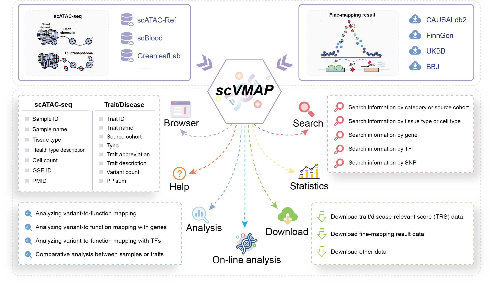

# Welcome to SCVdb Database Development Back-end!

> SCVdb: https://bio.liclab.net/scvdb/

> SCVdb tutorial: https://scvdb-tutorial.readthedocs.io/en/latest/index.html

> SCVdb front-end: https://github.com/YuZhengM/scvdb_web

A comprehensive platform for human **integrating** `single-cell chromatin accessibility data` with `causal variant effects`.

## Introduction

> Bioinformatics website: SCVdb

> Framework: SpringBoot (3.0.5)

> Database: MySQL (8.0.32)

> Cache: Redis (6.2.11)

> Deploy: Docker (19.03.5)

## 部署

[README.md](src/main/resources/storage/deploy/README.md)
